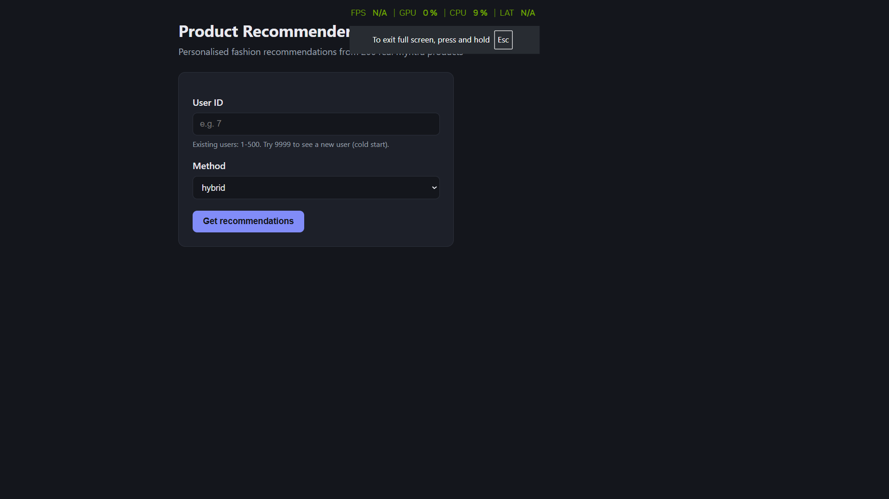
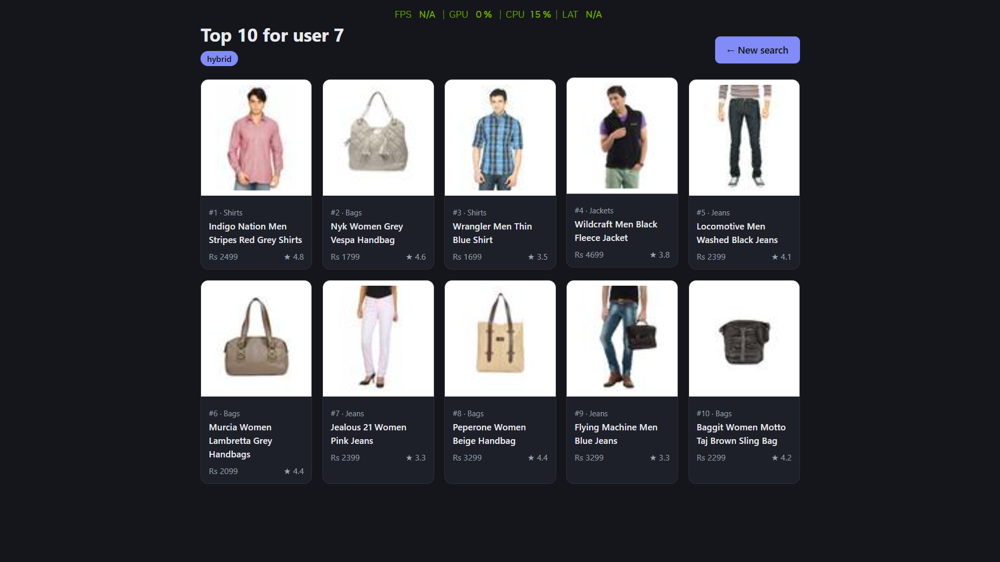

# E-commerce Product Recommendation System

Hybrid and multimodal product recommender for a fashion catalogue: item-based collaborative
filtering, Sentence-Transformer content embeddings, ResNet50 image features, a GCN over a
co-purchase graph, and a PyTorch model trained with BPR loss. Served through a Flask web app.

**Tech:** Python, pandas, NumPy, SciPy, scikit-learn, PyTorch, PyTorch Geometric,
torchvision (ResNet50), sentence-transformers (MiniLM), Hugging Face Datasets, Flask

## Results (leave-one-out evaluation, 228 held-out test users)

| Method                                   | HR@10 | NDCG@10 |
|------------------------------------------|-------|---------|
| Random                                   | 0.075 | 0.039   |
| Popularity baseline                      | 0.211 | 0.108   |
| Original implementation (CF)             | 0.197 | 0.109   |
| Content (MiniLM embeddings)              | 0.232 | 0.103   |
| Graph-smoothed content (1-hop GCN)       | 0.276 | 0.147   |
| Multimodal PyTorch model (BPR + GCN)     | 0.294 | 0.170   |
| Item-based CF                            | 0.373 | 0.196   |
| **Hybrid: 75% item-CF + 25% content**    | **0.364** | **0.197** |

- The final hybrid improves HR@10 by **85%** over the original implementation and is about
  **1.7x** the popularity baseline.
- Hybrid and item-CF are **tied within noise** on test (about +/-3 points with 228 users).
  The hybrid was kept because alpha = 0.75 was chosen on a **separate validation set** (never on
  test), and its content part can still recommend new products that have no purchase history.

## Screenshots
| Search | Recommendations |
|---|---|
|  |  |

## Data
- **Products:** 200 real products (25 per category, 8 categories) from the Fashion Product
  Images (Small) dataset (Myntra catalogue): names, colours, usage, gender and photos.
  Price and rating are simulated.
- **Users:** 500 simulated users with hidden category preferences, a long-tail product
  popularity, browsing (80% in liked categories) and purchases (35% vs 10% buy probability).
  Real purchase logs are private, so behaviour is simulated; everything is reproducible (seed 42).

## How the final model works
1. **Item-CF:** products are similar if the same users interacted with them (cosine similarity on a
   user x product matrix, purchases weighted 4x browses). A user's score for a product is the sum of
   its similarities to everything they interacted with.
2. **Content:** each product's text is embedded with MiniLM; a user's taste vector is the weighted
   average of the products they interacted with; products are scored by cosine similarity to it.
3. **Hybrid:** both scores are min-max scaled over unseen products and mixed 75% / 25%.
   New users with no history fall back to the most popular products.

## Pipeline
| Notebook | What it does |
|---|---|
| 01_data_generation | Real products + images, simulated users, browsing and purchases |
| 02_eda_and_baselines | Sparsity, long tail, cold start; tests the original methods (first synthetic catalogue) |
| 03_improved_recommenders | Item-CF (cosine), embedding content model, normalised hybrid (first synthetic catalogue) |
| 04_evaluation | Leave-last-purchase-out split, HR@10 / NDCG@10, baselines, alpha tuning |
| 05_embeddings | ResNet50 (frozen) image and MiniLM text embeddings, precomputed |
| 06_gcn | Co-purchase graph, GCN propagation by hand and verified against PyG GCNConv |
| 07_multimodal_training | PyTorch model trained with BPR, early stopping, GCN ablation |
| 08_app | Builds and runs the Flask app |

## Key findings
- **Metric choice matters:** content-based scored 99% on category match (notebook 03, first synthetic
  catalogue) but was below the popularity baseline at predicting the exact next purchase.
- **Leakage:** every purchase follows a browse of the same product, so the test item's browse
  is also removed from training.
- **GCN:** one hop of graph smoothing improved content NDCG by 43%; two or more hops hurt
  (over-smoothing). It gave no extra gain on top of item-CF, since both use co-purchase signal.
- **Neural model:** the untrained original model scored at random level (HR@10 0.06). Training
  with BPR lifted it to 0.29-0.33, but it overfits after about 10 epochs (~200k parameters,
  ~7k interactions) and does not beat item-CF at this data size. A GCN ablation showed no
  significant difference.
- **Diversity:** content-based top-10 covers 1.7 categories (filter bubble) vs 3.1 for item-CF.

## Run it
**In Google Colab (recommended):**
1. Run notebooks 01, 05, 06 and 07 (they save data, embeddings, the graph and model weights to
   Google Drive). Run 04 to reproduce the evaluation.
2. Run notebook 08 to start the app.

**Locally (after running the notebooks):**
1. `pip install -r requirements.txt`
2. Copy the 6 CSVs, `image_emb.npy`, `text_emb.npy`, `edge_index.npy` and `multimodal_gcn.pt`
   into the project folder, and the 200 product images into `static/images/`.
3. `python app.py`, then open http://127.0.0.1:5000

## Project structure
- `recommender.py` - loads data and models once, scores all methods, cold-start fallback
- `app.py` - Flask routes with input validation
- `templates/`, `static/` - HTML pages and shared CSS (light and dark mode)
- `notebooks/` - the full pipeline, 01 to 08
- `legacy/model.py` - the original implementation, kept for comparison

## Limitations and next steps
- User behaviour is simulated; real interaction logs would be needed to confirm the results.
- Small data: ~200 test users means about +/-3 points of noise on HR@10; with more data,
  use cross-validation for tuning.
- Leave-one-out is per user, not a single global time cut-off; a strict temporal split would be
  more realistic.
- Negative sampling can occasionally pick a user's held-out item; excluding held-out items would be cleaner.
- The app's neural model uses weights trained on the training split; for deployment it should be
  retrained on all data, like the CF and content parts.
- The neural model needs more data, smaller embeddings or stronger regularisation.

## Acknowledgements
This project started from an existing open-source recommender codebase (kept in `legacy/`).
I found its multimodal model was never trained, its GCN output was unused and it had no
evaluation, and rebuilt the data pipeline, evaluation, models, training and app.
Background reading on recommender systems is listed in `references.txt`.
